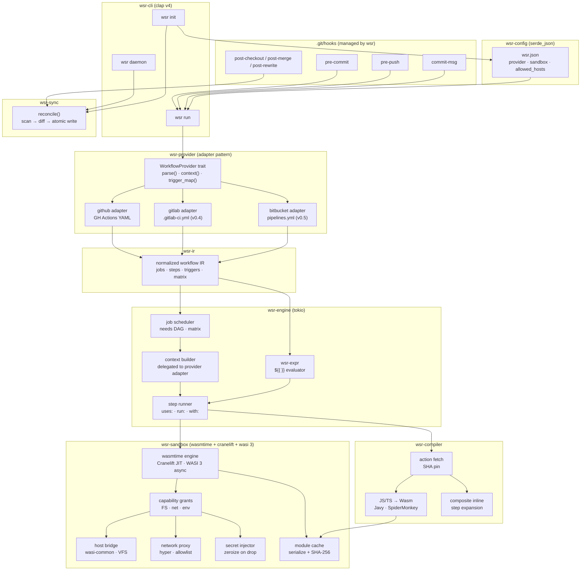
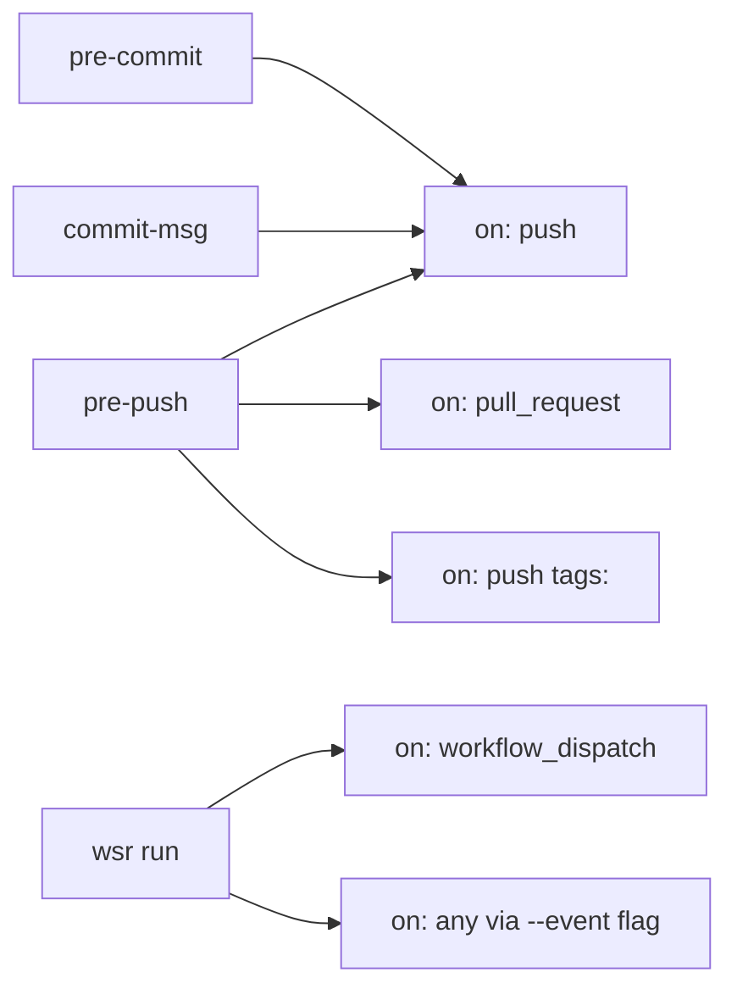
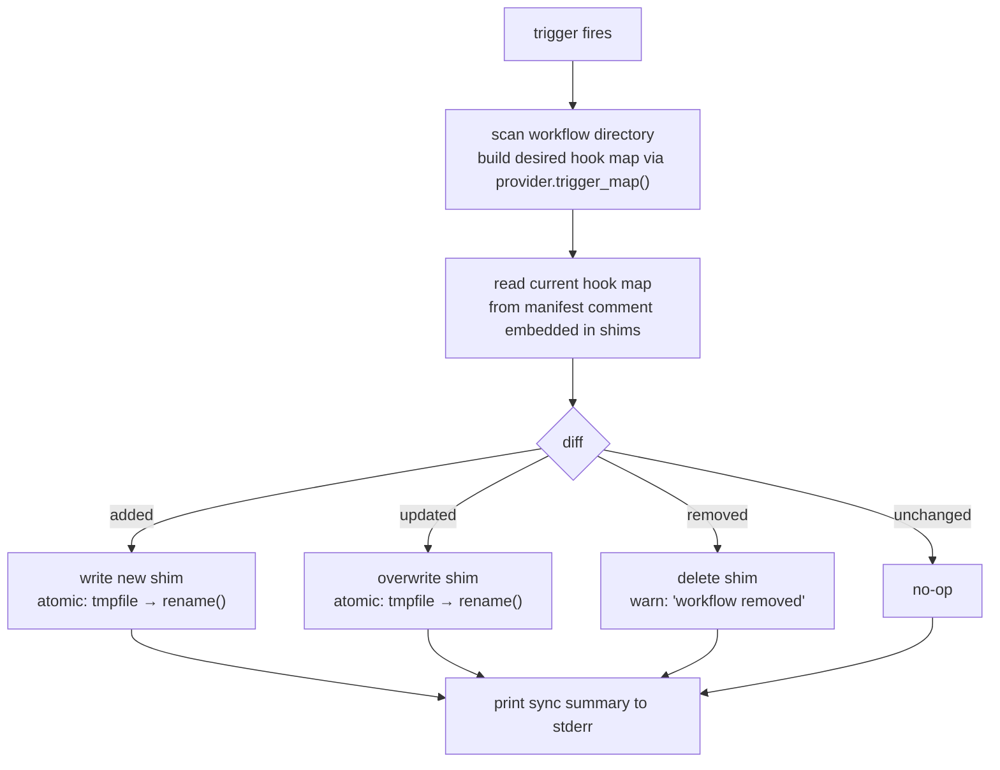
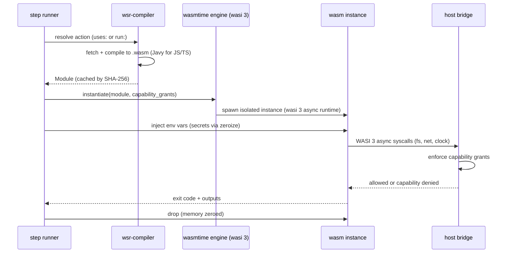
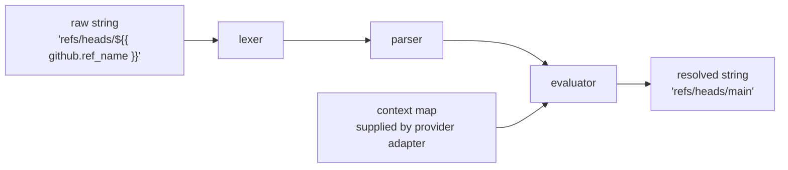
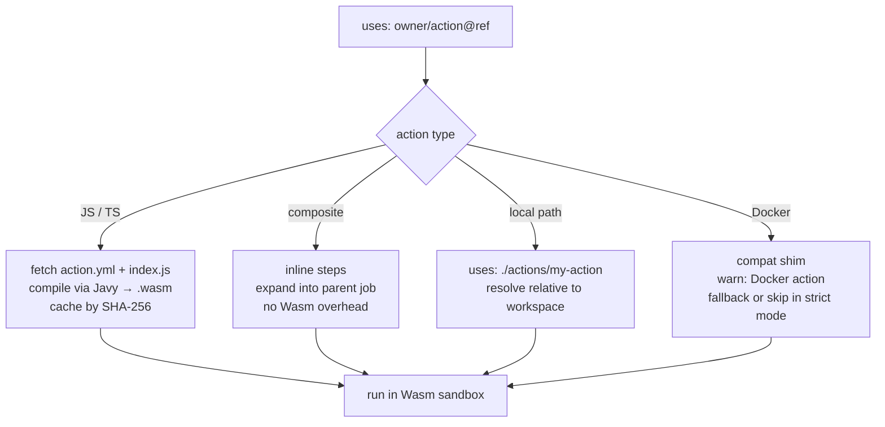
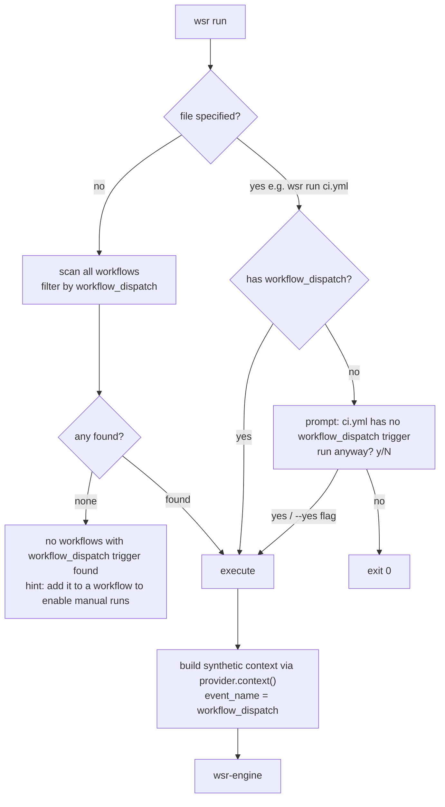

# wsr architecture

This document describes the internal architecture of `wsr`. It is intended for contributors and for
anyone who wants to understand how the pieces fit together.

---

## overview

`wsr` is a local CI runner built in Rust. It intercepts git hooks, maps them to workflow triggers,
and executes matching workflows in a Wasmtime sandbox — one isolated instance per step. It is built
around a provider adapter pattern so that GitHub Actions, GitLab CI, and Bitbucket Pipelines share
the same execution engine and sandbox, with only the parser and context layer differing per
provider.

The design has five commitments:

1. **100% workflow syntax compatibility** — same YAML, same expressions, same action versions, per
   provider
2. **Wasm-native sandbox** — security by construction, not by policy
3. **WASI 3 async** — native async layer to Wasm, no polling or callback wrappers
4. **Stateless sync** — no lock files, no databases, trust git to own the filesystem
5. **Zero required config** — `wsr init` is enough, `wsr.json` is optional

---

## crate map

```
wsr/
├── crates/
│   ├── wsr-cli/          # clap v4 — entry point, subcommands
│   ├── wsr-config/       # serde_json + figment — wsr.json parsing, defaults
│   ├── wsr-sync/         # hook reconcile — scan, diff, atomic write
│   ├── wsr-provider/     # WorkflowProvider trait + adapter impls
│   │   ├── github/       # GitHub Actions parser + context builder
│   │   ├── gitlab/       # GitLab CI parser + context builder (v0.4)
│   │   └── bitbucket/    # Bitbucket Pipelines parser + context (v0.5)
│   ├── wsr-ir/           # internal IR — normalized workflow representation
│   ├── wsr-expr/         # ${{ }} expression evaluator
│   ├── wsr-engine/       # tokio — job DAG, step runner, action resolver
│   ├── wsr-sandbox/      # wasmtime + wasi 3 — per-step Wasm instances
│   ├── wsr-compiler/     # Javy — JS/TS action → Wasm compilation + cache
│   └── wsr-tracing/      # tracing + tracing-subscriber — structured output
```

---

## layer diagram



---

## provider adapter pattern

`wsr-provider` defines a single trait. Each CI provider implements it. The engine and sandbox never
know which provider is active.

```rust
pub trait WorkflowProvider {
    /// parse raw workflow file bytes into the normalized IR
    fn parse(&self, raw: &[u8]) -> Result<WorkflowIR>;

    /// build the context object for expression evaluation
    fn context(&self, event: &TriggerEvent) -> Result<ContextMap>;

    /// map provider trigger names to git hook names
    fn trigger_map(&self) -> HashMap<Trigger, GitHook>;
}
```

`wsr.json` declares the active provider:

```json
{
	"$schema": "https://wsr.dev/schema/wsr.json",
	"provider": "github"
}
```

`wsr-ir` is the normalized representation that all providers compile to. It is also the interchange
format for the daemon, the CLI, and any future tooling — designed to be serialized as JSON without
loss of information.

---

## git hook → workflow trigger mapping

Each provider implements `trigger_map()`. The GitHub adapter maps:



`workflow_dispatch` is the default event for `wsr run`. Add it to any workflow to enable local
manual runs without pushing — the same way you would trigger it manually from the GitHub UI.

---

## wsr.json

Generated by `wsr init`. Parsed by `serde_json` — no extra crates. Serves as both user config and
internal interchange format.

```json
{
	"$schema": "https://wsr.dev/schema/wsr.json",
	"provider": "github",
	"sandbox": {
		"allowed_hosts": [],
		"secrets_from": ".env.wsr"
	}
}
```

The `$schema` field enables IntelliSense and inline validation in any JSON Schema-aware editor.
Because `wsr.json` is plain JSON, it is readable and writable by any language without extra
dependencies — Python's `json` module, Node's `require()`, `jq` in shell scripts.

---

## sync algorithm

Triggered by `post-checkout`, `post-merge`, `post-rewrite`, and the daemon watcher. Always a full
reconcile — never a patch.



**No lock file.** The manifest comment embedded in each shim is the entire state:

```bash
#!/bin/sh
# wsr:managed provider=github workflows=ci.yml triggers=push,pull_request
exec wsr run --hook pre-push "$@"
```

**No coordination logic.** Git holds the filesystem lock during `pull`, `checkout`, and `rebase`.
The daemon only fires on manual edits between git events. These windows never overlap — `rename()`
atomicity is the only guarantee needed.

---

## wasm sandbox — per step lifecycle

Each step spawns a fresh Wasmtime instance running on WASI 3. WASI 3's native async layer means
steps with async I/O (network calls, file reads) do not block the Wasmtime thread — the runtime
drives the async executor directly without polling adapters or callback wrappers.



**Capability grants** are computed per step from the workflow definition and `wsr.json` overrides:

```
preopened_dirs  = [workspace_dir]          # always
allowed_hosts   = []                       # default: none
env_vars        = [explicit env: keys]     # only declared vars
secrets         = [declared secret names]  # injected, never written to disk
```

---

## expression evaluator

`wsr-expr` implements the full `${{ }}` surface. Each provider adapter supplies the context map —
the evaluator is provider-agnostic.



Supported contexts (GitHub adapter): `github.*` · `env.*` · `runner.*` · `secrets.*` · `needs.*` ·
`steps.*` · `inputs.*`

Supported functions: `contains` · `startsWith` · `endsWith` · `format` · `join` · `toJSON` ·
`fromJSON` · `success` · `failure` · `always` · `cancelled` · `hashFiles`

---

## action resolver — compatibility strategy

MVP targets 100% syntax compatibility. Performance optimisations come after correctness is proven.



JS/TS actions (the majority of the marketplace) are compiled once and cached. The cache key is the
action's resolved SHA — not the tag — so `@v4` always pins to a specific commit.

---

## wsr run — trigger resolution



---

## observability

All output goes through the `tracing` crate. Two output formats:

**human (default)** — compact, coloured, git-hook-friendly:

```
[wsr] pre-push · running ci.yml
  ✓ step: cargo test              8.1s
  ✓ step: cargo build --release  12.3s
  ✗ step: docker push             0.3s
    capability denied: net → registry.example.com
[wsr] failed · 20.4s · exit 1
```

**GH Annotations (`--format=gha`)** — for cases where wsr output is consumed by a GH Actions step:

```
::error file=src/main.rs,line=42::cannot borrow `state` as mutable
::notice::step cargo test passed in 8.1s
```

---

## design decisions

| decision                                       | rationale                                                                                                                         |
| ---------------------------------------------- | --------------------------------------------------------------------------------------------------------------------------------- |
| provider adapter pattern                       | GitHub Actions is the reference impl; GitLab and Bitbucket share the same engine and sandbox via `WorkflowProvider` trait         |
| `wsr.json` over `wsr.toml`                     | `serde_json` already in the tree; readable by any language without extra deps; doubles as IR; `$schema` gives editor IntelliSense |
| `wsr-ir` as normalized representation          | providers compile to a shared IR; the engine and sandbox never know which provider is active                                      |
| Wasmtime + Cranelift over WASMer               | Cranelift JIT gives best performance for the Rust-native path; WASI 3 support most mature                                         |
| WASI 3 over WASI 2                             | native async layer to Wasm; no polling adapters or callback wrappers for async steps                                              |
| one Wasm instance per step                     | strongest isolation boundary; simplifies capability reasoning; instances are cheap with AOT cache                                 |
| stateless sync via rename()                    | git already serialises filesystem access; no coordination logic needed                                                            |
| `workflow_dispatch` as default `wsr run` event | mirrors GH Actions manual trigger exactly; dev learns one mental model, not two                                                   |
| 100% compat before perf                        | correctness is the product; optimisation is an implementation detail                                                              |
| no `wsr.json` required                         | zero-friction init is a first-class goal; config is opt-in override, not baseline requirement                                     |
| trust git for filesystem ownership             | concurrent sync is a git problem (merge conflict), not a wsr problem                                                              |

| no `wsr.json` required | zero-friction init is a first-class goal; config is opt-in override, not
baseline requirement | | trust git for filesystem ownership | concurrent sync is a git problem
(merge conflict), not a wsr problem |
